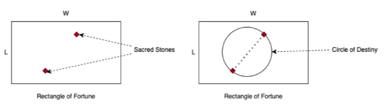
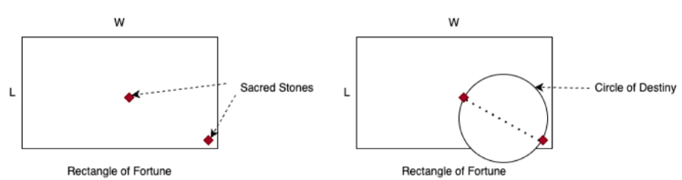

# Omens

Hanna Lonely, captain of the starship Century Hawk, and her crew, have arrived to the planet C0-3, carrying precious (and dubiously legal) cargo for the Kingdom of Fomana.

The Fomanians are a very superstitious people. Once a year (that’s what they call their cicle around their star, CO), they celebrate the Omens Day, which happens to be the next day Captain Lonely and her crew arrived to C0-3. On this day, the Royal Oracle performs the divination ritual, by throwing a pair of Sacred Stones on the Rectangle of Fortune.

The Rectangle of Fortune is an $L \times W$ rectangle, precisely drawn on the sands of the Sacred Beach. Once the Royal Oracle has thrown the Sacred Stones, she proceeds to draw the Circle of Destiny, in which the stones are in exactly oposite sides; the diameter of the circle is the distance between the two stones.

Fomanians believe it’s a good omen, when the resulting Circle of Destiny is completely contained within the Rectangle of Fortune, clearly meaning their destiny in good fortune. On the other hand, a bad omen is when the Circle of Destiny is partially outside the Rectangle of Fortune.

This is an example of good omen:



This is an example of bad omen:



The nature of the Sacred Stones is to always fall within the Rectangle of Fortune, and you can assume they are equally likely to fall anywhere within the rectangle.


The recently appointed Royal Oracle is quite progressive. She went to the Galactic University, and wants Captain Lonely to help her calculate the probability a thrown resulting in a good omen, given the dimensions of the Rectangle of Fortune. As the most junior member of the crew, you are tasked with this calculation.


## Input


The input consists of several test cases. A case is defined with a line with two positive integer values $L$ and $W$, $1 \leq L, W \leq 1 000$, representing the dimensions of the Rectangle of Fortune.

``` text
L W
```

The end of the input is signaled with a line

``` text
0 0
```

that should not be processed.

The input must be read from standard input.

## Output

For each test case output a line with the probability of the Circle of Destiny being completely contained within the Rectangle of Fortune, rounded to 4 decimal places.

The output must be written to standard output.

### Sample Input

``` text
1 1
20 40
40 30
0 0
```

### Sample Output

``` text
0.5236
0.3927
0.4909
```


