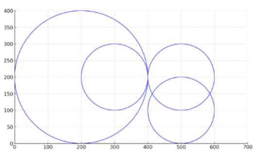

# Signal Coverage

The Nlogonia government is in negotiations with a telecommunications provider to cover a region of the country.

The commitment includes installing n antennas. Each antenna has a coverage radius (which defines a circular area with its border included), a planned location on the map of Nlogonia, and can be active over a given time range. More formally, the $n$ antennas are numbered from $1$ to $n$. The coverage radius of antenna $i$ is $r_i$, its planned location is $(x_i, y_i)$ , it goes into operation at 00:00 on day bi and goes out of operation at 00:00 on day $e_i + 1$.

For the benefit of both parties (the economy of Nlogonia and the profit for the supplier), two types of restrictions have been imposed:

- Restriction imposed by Nlogonia: No point should be covered by more than one antenna at the same time.
- Restriction imposed by the supplier (pair restrictions): A list of antenna pairs will be provided. For every listed pair, at least one of the antennas must be installed.

Your task is to determine a list of antennas to be installed that meet the restrictions outlined in the agreement, or to conclude that it is impossible to do so.

For instance, consider the 4 antennas illustrated in the figure below. Antenna number 1 has a coverage radius of 200 and is centered at the point (200, 200). The other antennas each have a coverage radius of 100 and are located at (300, 200), (500, 200) and (500, 100), respectively. Assume that all four antennas share the same activation time period. The pair restrictions are (1, 2), (3, 4) and (1, 4). In this case, it is possible to satisfy the restrictions by activating antennas 2 and 4.



## Input

The input consists of several lines. The first line contains the number of test cases.

Each case is described as follows:

The first line contains two integers: $n$, the number of antennas $(2 \leq n \leq 10 000)$, and $m$, the number of pair restrictions $(1 \leq m \leq 10 000)$. In the next $n$ lines, the $i$-th line contains five integers: $r_i$, $x_i$, $y_i$, $b_i$ and $e_i (1 \leq r_i, x_i, y_i \leq 5 000 \text{ and } 1 \leq b_i \leq e_i \leq 5 000)$, decribing the i-th antenna. The next m lines describes the pair restrictions: the $j$-th line contains two integers: $u_j, v_j (1 \leq u_j, v_j \leq n \text{ and } u_j , v_j)$, describing the $j$-th pair restriction.

The input must be read from standard input.

## Output

For each case, if it is impossible to find a list of antennas that satisfy the constraints, output one line with the word Impossible. Otherwise, output one line containing an $n$-long string where the $i$-th symbol (counting from left to right) is 1 if the $i$-th antenna is to be installed, and 0 otherwise. If multiple solutions exist, the output corresponding to any one of them should be printed.

The output must be written to standard output.

### Sample Input

``` text
3
2 1
1000 500 500 100 200
100 400 300 20 101
1 2
4 3
200 200 200 1 10
100 300 200 1 10
100 500 200 1 10
100 500 100 1 10
1 2
3 4
1 4
4 3
100 200 300 1 100
100 300 300 1 50
100 200 200 1 25
100 300 200 10 70
1 2
2 3
3 4
```

### Sample Output

``` text
01
0101
Impossible
```


