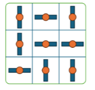
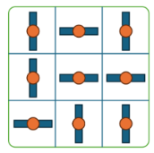
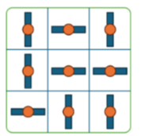

# Turnswitch

The starship Century Hawk is in the middle of a loosing battle with a squad of space pirates, possibly after realizing their business with Captain Hanna Lonely was actually, sort of a scam. There is no escape but to jump to hyperspace. Unfortunately, the Century Hawk has been at the receiving end of heavy fire, and though Captain Lonely is a skilled pilot, the space pirates managed to hit home before she could shield up.

"It must be the hyperdrive regulator Turnswitch, it’s not responding!" - yells the second in command.

"You, newbie, go to the hyperdrive and fix it up!" - Captain Lonely orders.

As the newbie - and the only crew member of the Century Hawk with any programming skills - your task is to fix the Turnswitch, so the hyperdrive is back online.

The regulator Turnswitch is an N × N matrix of switches, each switch can be either in horizontal or vertical position.

You discover that if you turn any switch -from horizontal to vertical or viceversa-, all the directly adjacent swiches (up, down, left, right) will also turn. If a switch is on an edge of the matrix, or in a corner, the positions outside the matrix are ignored.

For instance let’s consider the following 3 × 3 Turnswitch:



If you turn the switch at the very center, the Turnswitch will become:



Now, if you turn the switch of the bottom left corner, the Turnswitch will become:



The Century Hawk can jump to hyperdrive if the switches in the Turnswitch are either all horizontal, or all vertical -it is a ship build under a very liberal set of standards. Your task is to find the least amount of switches to turn in order to make the Turnswitch ready for the jump.

The fate of the Century Hawk’s crew is in your hands.

## Input

The input consist of several test cases. Each test case starts with an integer $N (1 \leq N \leq 10)$, the size of the Turnswitch. The following $N$ lines contain the Turnswitch matrix. Each line contains N characters, either "|" (the vertical pipe) or "-" (the minus sign), representing the state of the switches. There is a valid solution for each test case. The last line of input will be a 0 (zero) and should not be processed.

The input must be read from standard input.


## Output

For each test case, print a single line with the minimum number of switches that need to be turned in order to make the Turnswitch ready for the jump, e.g. all the switches become either horizontal or vertical.

The output must be written to standard output.


### Sample Input

``` text
3
-||
---
|-|
3
||-
|-|
-||
4
-|-|
||-|
||-|
||--
4
|||-
|---
-|--
-|-|
0
```

### Sample Output

``` text
3
2
3
3
```

